# 操作系统报告：Lab0&1

小组成员：
杨涵 2213739
文昱韦 2213125
郭军凯 2213627

## Lab0:指令执行流程

### 流程说明

从上电开机到执行第一条指令，大概可以分为以下两个阶段：

**1.文件加载阶段：**
两个文件将被加载到 Qemu 的物理内存中：即作为 bootloader 的 opensbi.bin 被加载到物理内存以物理地址 0x80000000 开头的区域上，同时内核镜像 os.bin 被加载到以物理地址 0x80200000 开头的区域上。

**具体而言，这个过程是通过makefile文件指定源代码目录、编译内核（源代码+链接脚本→内核可执行文件）、生成镜像文件加载入模拟器来进行的。**

**2.指令执行阶段：**
Qemu CPU的PC初始化为0x100（同样由Qemu自身决定），执行数条指令后跳转到0x80000000执行bootloader承载的计算机初始化指令。执行完毕后，跳转到0x80200000，即我们选择的内核镜像文件处，也就完成了控制权对操作系统内核的移交。

### Tips

Q:发挥关键作用的文件？
除了写有内核逻辑的源代码文件外，kernel_ld链接脚本也至关重要，直接在编译内核时发挥作用，起着规定内存布局（规划编译文件组织结构）的作用。

Q:两个地址选择的讲究？
A:bootloader地址（0x80000000）是Qemu自身规定的，使用者通常无法更改；
**内核加载地址（0x80200000）由makefile文件中通过命令行参数指定，链接脚本规定内存布局，但pc跳转到这个地址的逻辑与命令行参数、链接脚本指认的base_adr均无关，应该是OpenSBI自身决定的。**

如果修改链接脚本的base_adr、保留命令行参数不变，内核镜像仍然能正常加载、pc仍然能正常运行到内核位置，但不建议这么做；

如果保留链接脚本的base_adr不变，修改命令行参数，内核镜像加载位置改变，pc跳转到0x80200000后能识别到这是链接脚本“指认”的内核入口处，但实际由于这里没放任何数据，无法正常加载。

Q:真实机器上的工作情况？
A:与Qemu上的“加载”类似，但在物理机上是以提前烧录好文件进磁盘，而后从磁盘读取文件到内存的形式。

Q:内核可执行文件为什么选择.bin格式？.elf格式是否可以？
A:不行。.bin文件只含有指令的机器码，.elf文件在开头还含有别的一些额外信息（如如段的加载地址,运行地址,重定位表,符号表等），而我们是直接让PC跳转到内核文件处，需要CPU找到可执行的指令。

### 实验过程

需要用到make debug指令和make gdb指令（以及后续自己添加的make self指令）。具体方法为，在一个终端执行make debug指令，另一个终端执行make gdb指令，而后可以在make gdb中输入后续操作，在debug对应终端观察到相应变化。

make debug和make qemu的唯一区别是添加了-s -S参数，即等待gdb连接，类似于高级语言编写中的断点操作。

加载文件到物理内存的一阶段无法从debug中体现，我们主要分析二阶段指令执行过程。

#### 1.pc从0x1000到0x80000000的跳转

**1B对应8位二进制数据，2位十六进制数据；地址以B为单位显示**
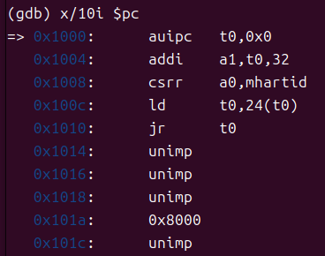
如图所示，逻辑顺序为：
①将0x80000000这个数据加载在内存中
②读取0x80000000进t0寄存器
③jr跳转指令至目标地址

**注意，图上之前两行之间间隔为4B（同时也是无压缩指令的长度），到数据显示之后两行之间间隔变成了2B！**


t0一开始赋值为0x1000，ld指令后转而加载0x1018的数据（从0x1018开始取4B，即0x1018到0x101b），
这个位置提前加载0x80000000入内存中。
由于Qemu中采用**小端序**存储数据，0x1018后4B的数据实际是这样存储的（从低地址到高地址，十六进制）：

地址 18 19 1a 1b
数据 00 00 00 80 

因此，图上才会显示0x101a读到的是0x8000（按照2B长度读取）。

如图所示，按照4B为长度读取读到的是0x80000000。
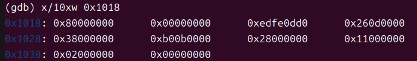
此外，a0 现在保存的是当前核 ID。这一步的作用可能是为了在后续处理中区分不同的 CPU 核；a1的作用并不明确。

#### 2.0x80000000到内核入口点（0x80200000）的跳转

pc跳转到0x80000000后进行一系列初始化工作（太多太杂，这里不作展示），而后跳转到0x80200000。

由于不太清楚具体的跳转函数在哪里定义，无法break断点且架构不支持record记录功能，只能通过不断尝试性的按地址break查找跳转前位置、查看有没有经过某个地址来寻找入口点。为了简化这个过程，我们编写了这样一个脚本来自动化这个过程：

```
define run_until_address
  set $flag = 0
  while $flag == 0
    set $last_pc = $pc
    si
    set $pc_value = $pc
    # printf "PC: %x\n", $pc_value
    if $pc_value == 0x80200000
      printf "Last pc: %x\n", $last_pc
      printf "Reached 0x80200000 at PC: %x\n", $pc_value
      set $flag = 1
      break
    end
  end
end

run_until_address
```

脚本使用方法：gdb中source scrpit.gdb。
为了加快脚本运行速度，需要将控制台打印信息重定向。在makefile中新添加定义即可。

```
self:
	riscv64-unknown-elf-gdb \
    -ex 'file bin/kernel' \
    -ex 'set arch riscv:rv64' \
    -ex 'target remote localhost:1234' \
    > gdb_output.txt 2>&1
```

**这个过程中可以发现，opensbi做的工作很是复杂，并不是ppt和讲解说明文档上一笔带过那样轻描淡写，期间有很多来回跳转过程。最后光是重定向出的文件（主要是si指令带来的debug信息）就有9.6MB！**

最后找到的入口点如图所示（一路从0x80000000运行过来）。
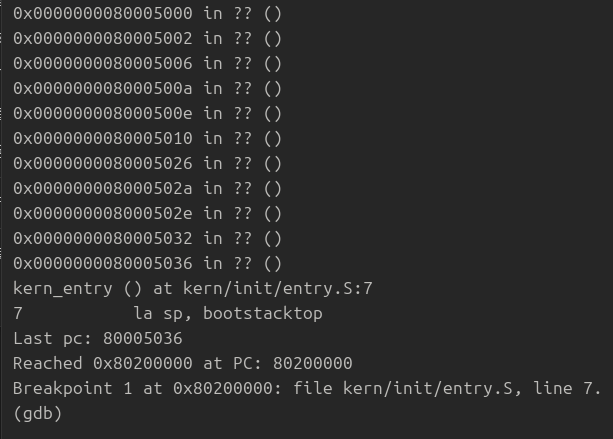

由mret指令，pc赋值为mepc寄存器的值，debug发现进入前该寄存器值由a2赋值而来，值确实是0x80200000。
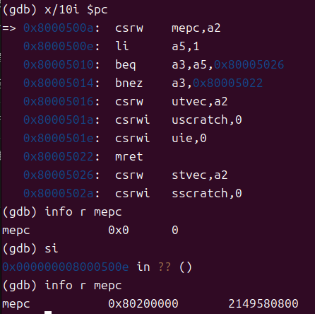

进一步watch监测a2寄存器值的变化。一路往上漫长的debug后，发现：
a2寄存器由a7赋值而来（0x800009d2 :	or	a2,a2,a7）
a7寄存器由t0赋值而来（0x800009c2:	or	a7,a7,t0）
继续向上回溯，终于找到一些和常量有关指令：
t0原先为0x80，slli后变为0x80000000，与t3 or后得到0x80200000。
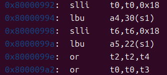

继续向上追溯，如图所示，t0和t3在这两个位置被加载为0x80、0x20。
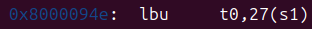
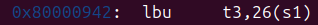

**修改链接脚本和命令行参数后发现，二者均无法影响OpenSBI初始化结束后的跳转地址。即0x80200000同样应该是OpenSBI自身指定的。**

**Q:跳转地址0x80200000是怎么定义的？**
**A:修改链接脚本和命令行参数后发现，二者均无法影响OpenSBI初始化结束后的跳转地址。即0x80200000同样应该是OpenSBI自身指定的。**

#### 3.kern_entry到kern_init的跳转

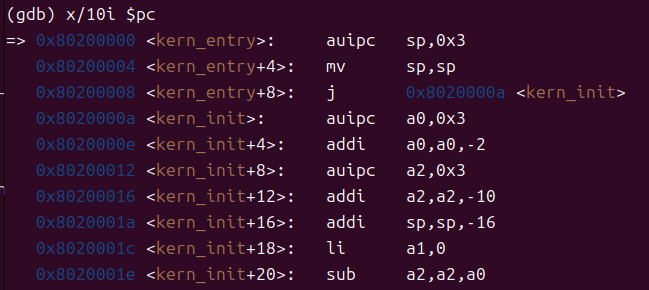
如图所示，kern_entry函数在entry.S中定义，作用是分配内核栈、直接跳转（j指令）到kern_init这一真正的内核入口点。后续在c文件中编写代码实现想要的功能。

## Lab1:中断

### 练习1

对应指令如图。
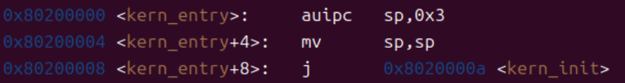

`la sp,bootstacktop`完成了将开机栈指针移动到sp寄存器这一操作，保证开机时寄存器sp处于正确的状态。

`tail kern_init`调用了`kern_init`这一函数，开始操作系统的启动操作。

### 练习2

根据描述实现代码即可，主要流程为：

- 设置下一次时钟中断。
- ticks计数器自增。
- ticks为100的倍数是输出相应内容，输出次数自增。
- 输出次数达到10之后，调用关机接口。

根据描述实现即可，具体实现如下。

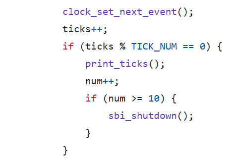

### 拓展练习1

#### 处理流程：

- 产生异常
- 保存上下文
- 调用异常处理函数
- 恢复上下文
- 重新执行程序

其中save all对应code做了保存上下文的工作，做了这些工作：

- 开辟栈帧
- 保存通用寄存器在栈中（包括sp）
- 加载csr寄存器值在s寄存器中（指令限制csr寄存器不能直接存入栈中）
- 将s寄存器值存入栈（实际是存入栈中形成trapframe结构体）

恢复上下文做的工作包括：

- 恢复各通用寄存器的值
- 恢复栈帧（直接加载sp在栈上的值）
- **将在func中修改了的sstatus和sepc值（存在栈中）加载回相应寄存器，用于sret指令跳转：恢复pc和状态寄存器值。**

#### `mov a0,sp`的作用：

为异常处理函数trap传参，trap函数需要一个指针指向`struct trapframe`，保存的寄存器按照该结构体的结果存储在内存中。

#### 保存位置是怎么确定的？

保存在栈中的位置由sp确定，也就是继续向栈顶添加元素。

#### 所有寄存器，在所有中断类型中都需要保存恢复吗？

并不是，只有在进入中断处理逻辑后，可能被覆盖（处理逻辑本身会对这些寄存器复用）、需要修改（异常处理逻辑需要修改某些寄存器的值，通过修改内存上的值再store恢复实现）的寄存器需要被保存恢复。

然而实际应用过程中，为了实现逻辑的简单性，是对所有通用寄存器进行了保存和恢复的过程的（除sscause和sepc之外的csr寄存器的保存是为了函数调用，且没有恢复过程）。

### 拓展练习2

由于sp寄存器还要用到，所以为了能够保存变化前的sp寄存器，这里将sp临时存入sscratch，后续再将sscratch的值读到s0里存入栈的正确位置，同时也将sscratch清零。

保存stval等寄存器是由于中断处理时需要用到，保存除了用于restore以外，还会作为函数参数，这里保存是为了在栈中形成结构正确的trapframe结构体，能够正确为trap函数的参数赋值。

### 拓展练习3

只需要输出相应的信息后修改epc即可。

修改epc是因为遇到非法指令后，不应当再执行一次非法指令，而应当执行非法指令的下一条指令；同理，断点异常需要跳过ebreak指令。

值得注意的是，riscv指令存在压缩指令（只有16位）；因此不管是非法指令异常还是断点异常都不能直接+2或者+4，需要先从trapframe中获得导致异常的指令的长度。

压缩指令（2B）的特征是最后两位不是0b11，非压缩指令（4B）最后两位一定是0b11，故可以利用该逻辑作出判断。

下面给出异常处理逻辑代码。
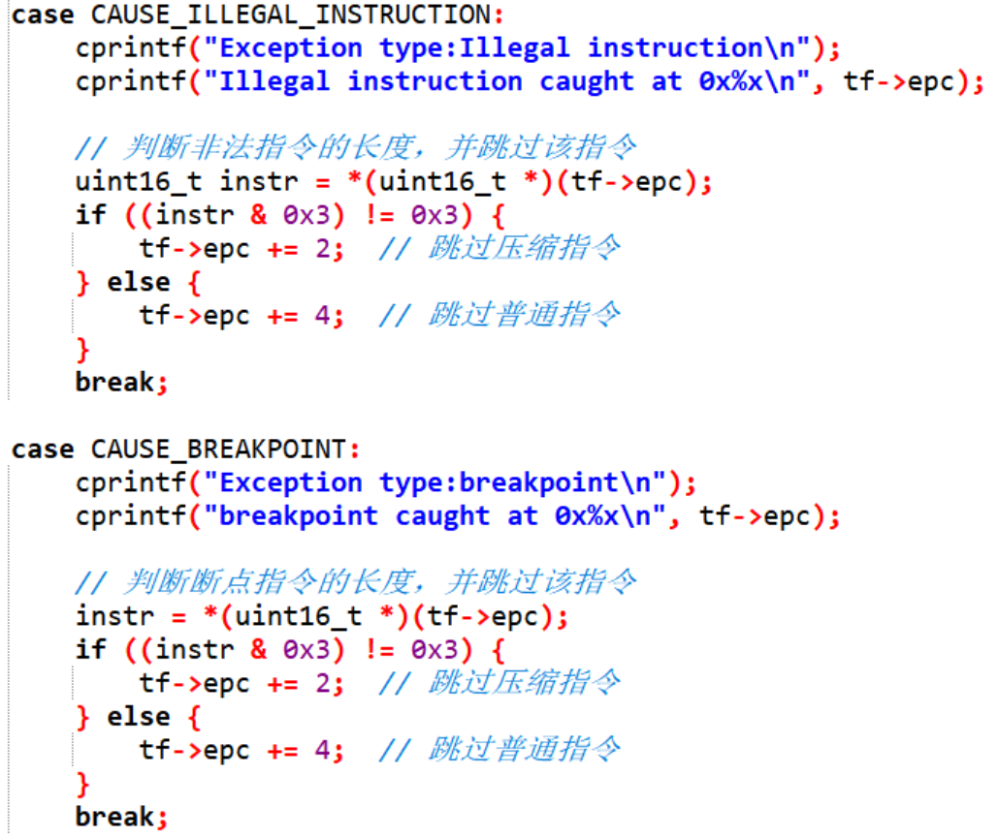

下面给出init中添加异常的方法。
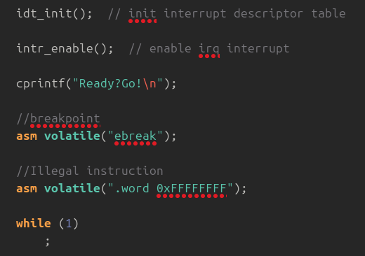

下面是对以上异常的处理结果截图。
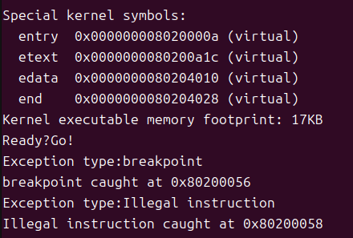